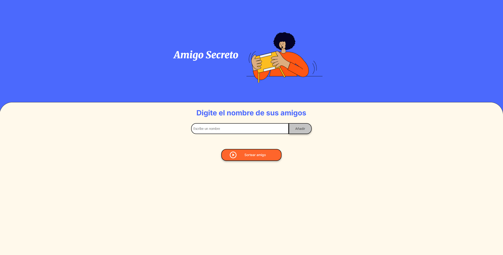
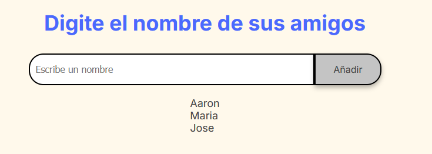
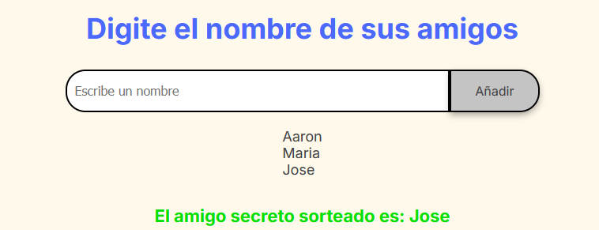
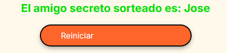

<h1 align="left"> Challenge Amigo Secreto </h1>

## Índice
*   [Vista inicial](#vista-inicial)
*   [Descripción del proyecto](#descripción-del-proyecto)
*   [Estado del proyecto](#estado-del-proyecto)
*   [Características de la aplicación y demostración](#características-de-la-aplicación-y-demostración)

# Vista inicial

# Descripción del proyecto

 El proyecto "Amigo Secreto" es una aplicación web que permite a los usuarios organizar un juego de amigo secreto de manera sencilla y divertida. Los usuarios pueden agregar los nombres de sus amigos, y la aplicación se encargará de sortear un amigo secreto al azar para cada participante. 

 La aplicación está diseñada para ser intuitiva y fácil de usar, con una interfaz amigable que permite a los usuarios agregar y gestionar sus amigos de manera eficiente. Además, la aplicación incluye características adicionales como la posibilidad de reiniciar el sorteo y ver los resultados de manera clara y organizada. 

# Estado del proyecto

 El proyecto se encuentra terminado y listo para su uso. 

# Características de la aplicación y demostración

La aplicación cuenta con las siguientes características:

<ul>
  <li>
    Agregar amigos a la lista de sorteos. 
    
  </li>
  <li>
    Sorteo de un amigo secreto al azar. 
    
  </li>
  <li>
    Reinicio del sorteo y la lista de amigos. 
    
  </li>
</ul>